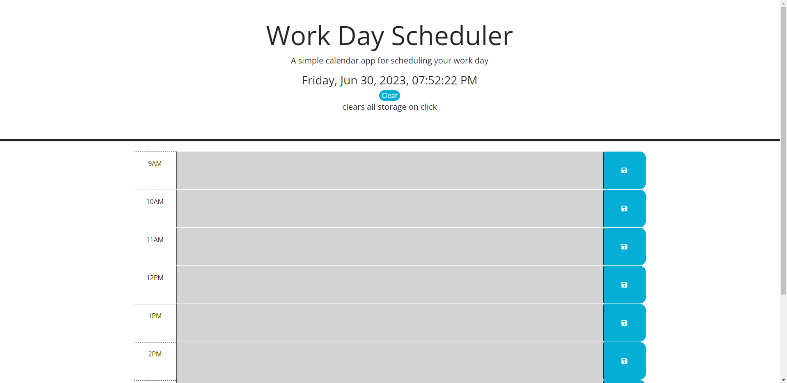

# Work-day-scheduler

https://ryanthescholar.github.io/Work-day-scheduler/

## Description

I wanted to build a project with jquery so that I could get a better understanding of the syntax and overall logic of JavaScript. I also engaged the concept of localStorage in this case saving items to the selected div id, also creating a dynamic function that changes the color of the text area when it is current, past or present which allowed me to get a better understanding of traversing and if statements. This project solves the problem of not having to set a new work day schedule upon page load every time due to the local storage implementation.
Some key points of learning for me this project are I need to focus more on functional coding instead trying to dive in on the most optimal code, because I am very new to this world grasping the core concepts and then going back and spicing up the code will be my next goal on upcoming challenges and projects.

## Table of Contents

- [Installation](#installation)
- [Usage](#usage)
- [Credits](#credits)
- [License](#license)

## Installation

N/A

## Usage

## Credits

N/A

## License

N/A

## Badges

## Features

added a clear localstorage button so user doesn't have to go into inspect element and clear applications storage in order to clear the whole schedule.

## How to Contribute

Ryan.business.bowen@gmail.com

## Tests

N/A